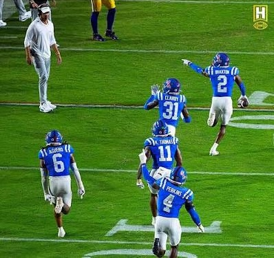

# Case Studies
## Three Case Studies 
This research aims to examine three specific case studies of coaches that departed from an institution looking specifically at the rhetoric surrounding each coach prior to their departure and arrival at each institution

  
  
  

#### Deion Sanders
Deion Sanders is well known by fans and non-fans alike. His name is synonymous with flash and football. Deion's first collegiate head coaching job was in 2020 being hired by Jackson State University, a notable HBCU. During his tenure as the head coach of the tigers, much of the rhetoric that surrounded the team was of transforming the narrative that HBCU's could not put together a notable football program, that they could not land the big recruits, that these schools were valuable to the black community and could compete with the blue-blood programs around the country. The messaging was clear. Deion aimed to transform the program, crafting a new identity for the storied institution. 

Problems arise in 2022 when Coach Sanders decided to leave the program after two seasons accepting the head coaching job at the University of Colorado, taking the recruits and identity with him. Prior to his arrival, Jackson State had built a ContentOps strategy centered around "Brotherhood" and HBCU Pride. This identity was subjugated by Deion's personal brand, with the institution embracing the "Coach Prime" persona, placing national attention on the university. There was an attempt by the institution to place labor and fan capital in a fixed position, however this position was overturned with Sander's acting at the Deleuzian "Nomad," using Jackson State's own content apparatus to accumulate more social capital before leaving to Colorado, leaving little behind in terms of identity and culture. 

This change in ContentOps is not exclusive to the abandoned institution either. The University of Colorado has historically output content reflecting their PWI (Predominantly White Institution) identity. Upon the hiring of Coach Sanders, this content strategy shifted drastically, prominently featuring distinctly Black culture and Black icons, intentionally pivoting the institution's public visibility. The ContentOps strategy began highlighting the systemic internal changes, heavily promoting the cultural change that Deion brought with his hire (thinking of the dining facilities suddenly having soul food available). The University of Colorado's digital architecture effectively synthesized and appropriated the Black cultural identity Sanders had cultivated coaching at an HBCU, presenting an PWI as a cultural hub for Black culture. The institution willingly subjugated its own historical identity to construct a new rhetorical apparatus that embraced Deion's identity, masking the transactional nature of a new hire within college athletics under a veil of cultural change and revolution. 

#### Lane Kiffin
Lane Kiffin's tenure at Ole Miss is representative of an ongoing trend in college athletics, using carefully selected and crafted digital visibility to mask mobility. During his time at Ole Miss, Kiffin's ContentOps strategy positioned him as a local hero that could navigate the transfer portal and masterfully craft a team that could compete at the highest level of college football. This strategy relied heavily on internet culture and aggressive social media engagement to cultivate a fervency among the fanbase. The messaging was a constant demand for a complete "buy-in" from his athletes and fans, promoting a unified vision against rival institutions. 

Kiffin's departure to rival LSU in late 2025 exposed this ContentOps strategy as an exercise in deceptive rhetoric. Ole Miss had deployed their ContentOps strategy as a trap of *Metis*, fixing the labor of student-athletes and fans through a percieved promise of loyalty and brotherhood only for Kiffin to abandon that culture for a more lucrative opportunity. Following his exit, the athletes remained trapped within the very loyalty that Kiffin preached, while he nomadically moved to greener pastures. 

Again, this change in content identity does not exsist solely for the abandoned institution. LSU's ContentOps drastically shifted from one that embraced traditional Southern values , stoicism, and paternal "family" values. When Kiffin assumed control, LSU abandoned this legacy branding, pivoting to a style over substance policy, embracing the chaotic bravado and portal-first attitude that Kiffin embodies. The content being produced felt more akin to social media trolling than to that of a blue-blood institution. An entirely new landscape was manufactured by the institution, subverting the traditional Baton Rouge mythos for one of modernity and individualism, all to accomadate Kiffin. LSU's CMS works as an active tool of deception, completely rewriting institituional identity to secure the capital brought in by Kiffin. 

#### Matt Campbell
For the better part of the last decade, Matt Campbell was positioned as the antithesis of the nomadic coach, making his 2025 departure from Iowa State to Penn State the most jarring. At Iowa State, Campbell had cultivated a brand centered entirely around "Five-Star Culture", Midwestern Grit and Determination, and unwavering institutional loyalty. He routinely turned down lucrative coaching offers to remain at Iowa State and the ContentOps reflected that, outputting content that worked as a constant reminder of loyalty to the institution. Every graphic and post emphasized "family" and long-term commitment to a unified goal, explicitly contrasting Campbell's program with the current reality of modern college football. 

When Campbell secured the head coaching job at Penn State, an unveiling occured of the deceptive rhetoric that was being used. Iowa State had crafted a digital architecture that functioned as an ethical trap, securing student-athlete and fan "buy-in" by weaponizing absolute loyalty. Campbell's departure, and the departure of over 50 student-athletes, brought this constructed reality crashing down, displaying that even the most concrete of institutional identities are subjugated to the mobile identity of the coach. The systemic invisibility of athletic labor becomes the most glaring function of the institution's architecture. The institution continues to demand unyeilding loyalty from student-athletes, entirely excusing and marketing the mobility of the head coach. 

Like our other two cases, Penn State was not immune to a shift in ContentOps identity, shifting immediately to serve the newly hired Nomad. Previously, Penn State had generated content that embraced an institutional flash, embracing the "107k Strong" of their stadium supporters and chasing the glamor of being a national powerhouse. Upon Campbell's arrival the CMS shifted to one that mirror Campbell's cultivated brand from Iowa State. The flash and glitz of crafted content was replaced with content that emphasized "grit" and "blue-collar" work ethic over glory. The Nittany Lions manufactured a "return" to Pennslyvanian roots, deliberately erasing the previous era's identity to better allign with Campbell's constructed authenticity. This shift from selling "flash" to selling "grit" provides an understanding that institutional "identity" is a fluid and manufactured strategy designed to fix student-athlete labor while concealing the head coach's identity and mobility. 