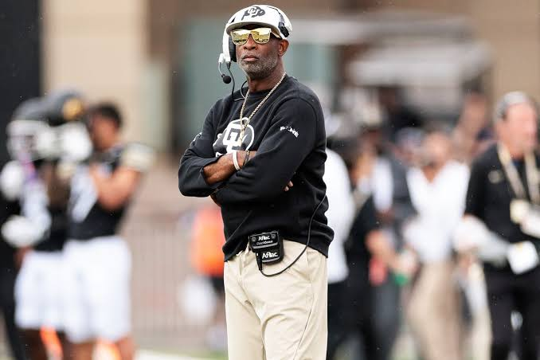
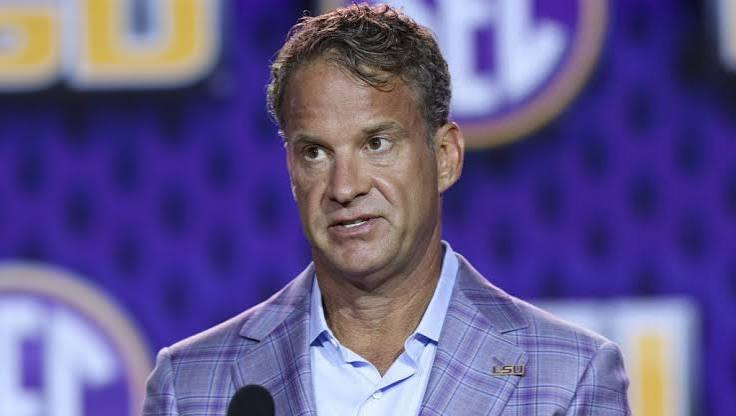
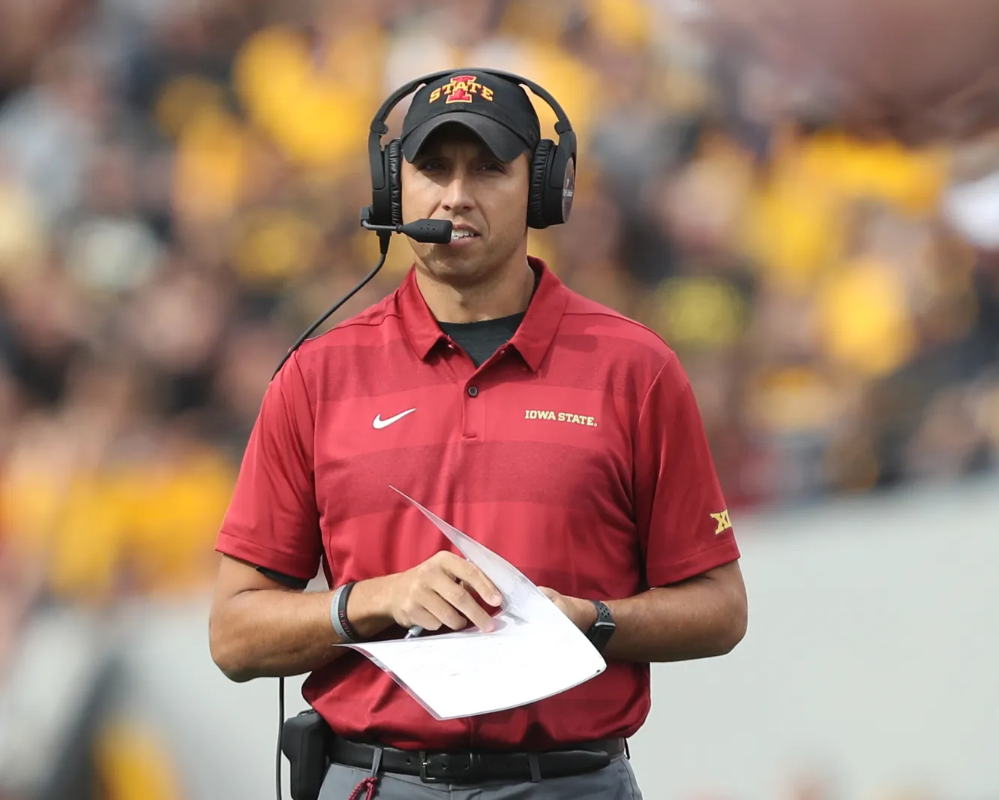

# Case Studies
## Three Case Studies 
This research aims to examine three specific case studies of coaches that departed from an institution looking specifically at the rhetoric surrounding each coach prior to their departure and arrival at each institution

  
  
  

#### Deion Sanders
Deion Sanders is well known by fans and non-fans alike. His name is synonymous with flash and football. Deion's first collegiate head coaching job was in 2020 being hired by Jackson State University, a notable HBCU. During his tenure as the head coach of the tigers, much of the rhetoric that surrounded the team was of transforming the narrative that HBCU's could not put together a notable football program, that they could not land the big recruits, that these schools were valuable to the black community and could compete with the blue-blood programs around the country. The messaging was clear. Deion aimed to transform the program, crafting a new identity for the storied institution. The problem arises in 2022 when coach Sanders decided to leave the program after two seasons and take the head coaching job at the University of Colorado, taking the recruits and identity with him. Jackson State's ContentOps was hijacked during coach Prime's tenure 