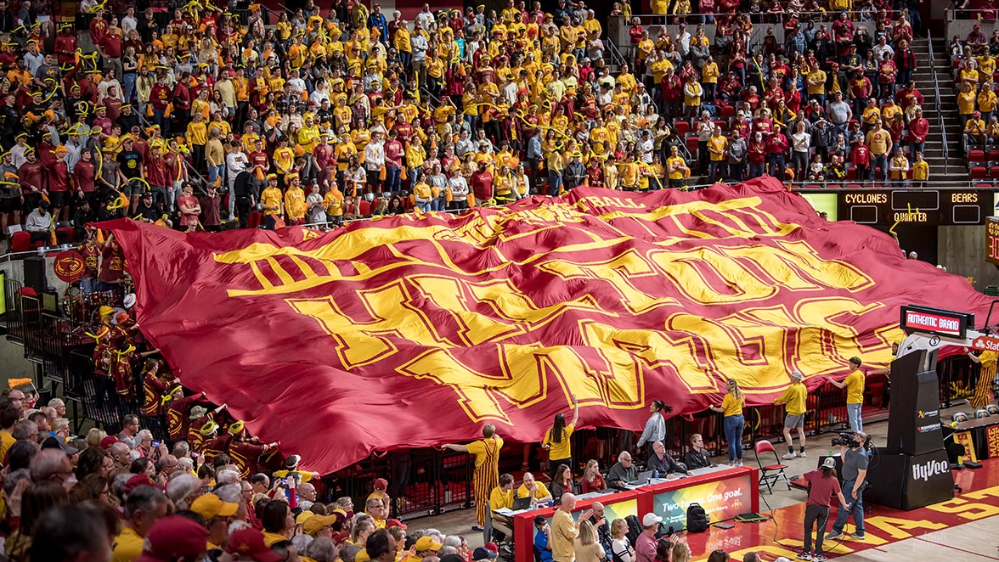
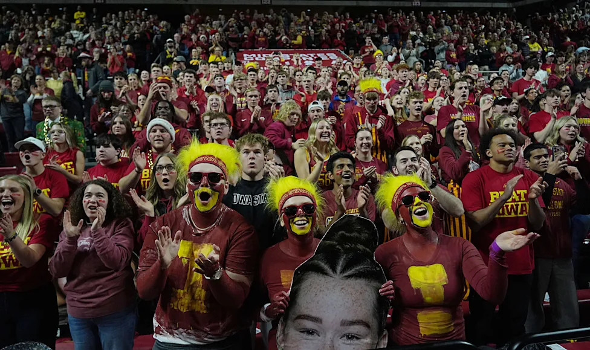

# ContentOps
## Athletic ContentOps

  
  

#### ContentOps
Content Operations (ContentOps) is the framework that aligns people and technology to produce, manage, and distribute content. ContentOps looks at the system in place for content creation, rather than looking at the content itself as individual acts of craft. The entirety of ContentOps looks to understand that creators are supported by workflows and technical infastracture to limit bottlenecking, ensuring that content creation is not an isolated or singular event.

#### ContentOps in College Athletics
Within athletics, and specifically collegiate football, there is a necessity for an outpouring of highquality and constant content. The media cycle for college athletics is often a never-ending and relentless process where content must be produce and distributed at a consistently high-volume and high-quality. ContentOps is the engine behind institutional control of narratives within the athletic department. The rapid flow of content allows for a projection of institutional stability and identity, allowing a program to use content strategy to deploy a unified message and identity, reacting in real-time to events on and off the field. 

#### Reason for Examination
Collegiate football programs have recently crafted an interesting landscape. The manner in which an athletic department will completely change its own identity to fit that of their head football coach and, just as quickly, change said identity immediately upon that coaches departure reveals a tension between coaching mobility and institutional loyalty worth analyzing. Coaches often preach messages of "loyalty" and "brotherhood" but are quick to leave when a more lucrative opportunity presents itself, taking the identity of the program with them. These identity shifts exist in a seemingly never-ending game of tug-of-war, attempting to maintain some balance on the core values of the institution while still reflecting the head of their program. This identity tension is the direct result of a ContentOps strategy that is forced to constantly produce content with the goal of maintaining institutional identity (and control) but has to reinvent itself to a fanbase everytime a coach leaves. This apparatus, then, will reveal the rhetorical strategies that institutions attempt to use to maintain power within a landscape that provides little certainty. 
