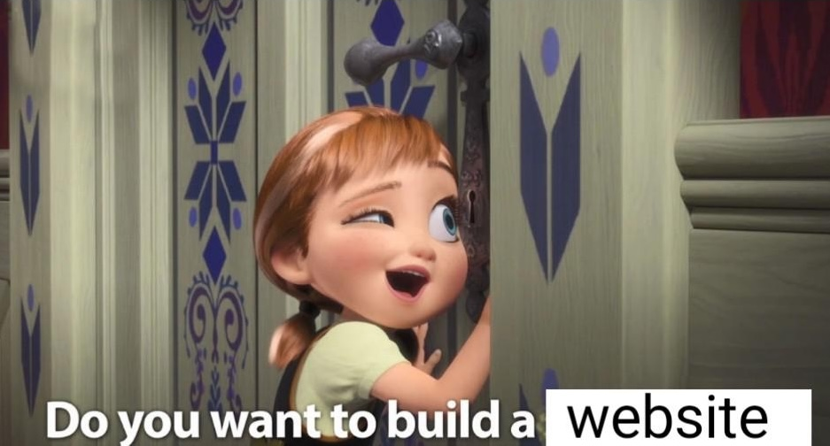

Welcome to the Homepage of myminidoc site!

## Purpose

This site exsist in two parts. 

-The first is to fulfill a class assignment, working within VS Code and Quarto to create a usable website. 

-The second is to begin to explore the beginnings of my final project, presenting the early stages of my thoughts on Dark Rhetoric and its involvement in the athletic communication within college sports. 

## Articles
Each article serves to provide a brief understanding of my research topic, breaking into the beginnings of what will become hours upon hours of research and writing. 

#### *Metis* and Theory
This page provides an understanding of what *Metis* and Deceptive Rhetoric is, looking to provide my current understanding and list of theories/theorists that I will be exploring. 

#### ContentOps in Athletics
This page will look to explain the contexts that I will be working within, looking to understand how ContentOps within collegiate athletics shifts with the employment of each coach, employing forms of dark rhetoric to garner fan engagement and student-athlete buy-in and recruitment, fundamentally altering the culture of each institution to fit the mold that the coach envisions.

#### Case Studies 
This page will provide my three case studies, listing the specific coaches that I plan to examine and how dark rhetoric shifted the culture and content of their respective institutions. 

